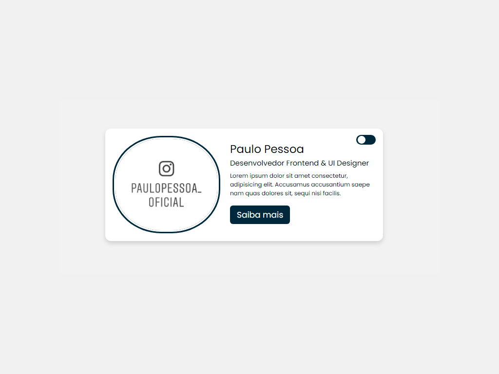

# Botão Modo Noturno

Visualizar o projeto: [clique aqui](http://botao-modo-noturno.epizy.com/?i=1)

- Tecnologias utilizadas:
	- HTML5
	- CSS3

- 📫 Como me encontrar:
	- Behance: [Paulo Pessoa](https://www.behance.net/mr-cerebro)
	- Dribble: [Paulo Pessoa](https://dribbble.com/mr-cerebro)
	- Facebook: [Paulo Pessoa](https://www.facebook.com/paulo1pessoa)
  	- Instagram: [Paulo Pessoa](https://www.instagram.com/_mrcerebro/)
  	- Linkedin: [Paulo Pessoa](https://www.linkedin.com/in/paulo-pessoa-2777841b2/)
  	- Twitter: [Paulo Pessoa](https://twitter.com/PauloPe65041263)

# Botão Modo Noturno

View the project: [click here](http://botao-modo-noturno.epizy.com/?i=1)

- Technologies used:
	- HTML5
	- CSS3

- 📫 How to find me:
	- Behance: [Paulo Pessoa](https://www.behance.net/mr-cerebro)
	- Dribble: [Paulo Pessoa](https://dribbble.com/mr-cerebro)
	- Facebook: [Paulo Pessoa](https://www.facebook.com/paulo1pessoa)
  	- Instagram: [Paulo Pessoa](https://www.instagram.com/_mrcerebro/)
  	- Linkedin: [Paulo Pessoa](https://www.linkedin.com/in/paulo-pessoa-2777841b2/)
  	- Twitter: [Paulo Pessoa](https://twitter.com/PauloPe65041263)
